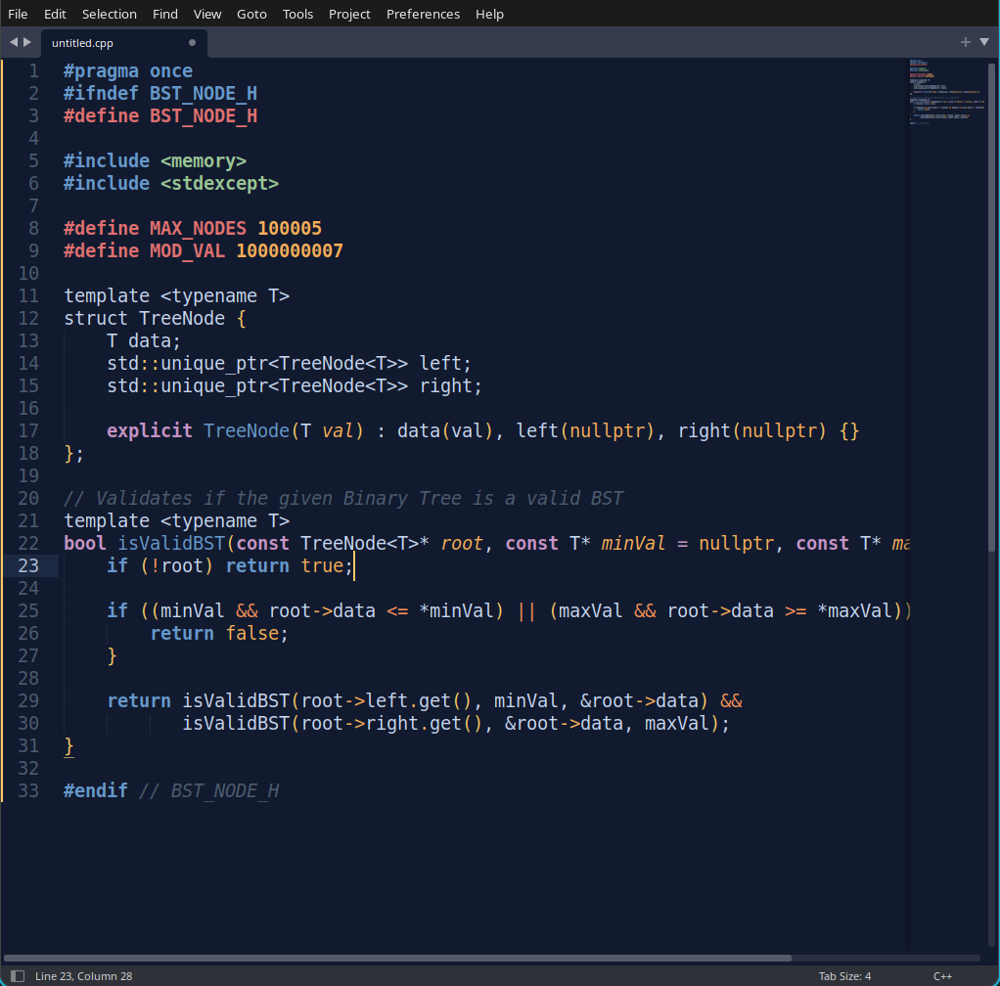

# 🌌 Borliana Color Scheme

*A dark Sublime Text theme: the lovechild of the striking Borland look and the soothing Mariana tones.*

> **Borliana** is a lightweight, minimalist color scheme forged specifically for solitary scrolls and algorithmic ruminations. It marries the heavy, bold visual weight of the classic Borland identity with the soft, eye-soothing pastel color science of Mariana. 

The result is a highly readable, high-contrast environment designed to keep you focused on logic and data structures, entirely without the retina burn.

---

## 📸 Preview

  

## 🚀 Installation

### Via Package Control (Coming Soon)
*Note: Borliana is currently pending approval on Package Control.*
1. Open the Command Palette (`Ctrl+Shift+P` on Windows/Linux, `Cmd+Shift+P` on Mac).
2. Type `Package Control: Install Package`.
3. Search for **Borliana Color Scheme** and hit `Enter`.

### Manual Installation
If you want to use it right now or test it:
1. Download the `Borliana.sublime-color-scheme` file from this repository.
2. Open Sublime Text and navigate to `Preferences > Browse Packages...`
3. Open the `User` folder (or create a `Borliana` folder inside `Packages`).
4. Drop the `Borliana.sublime-color-scheme` file into that folder.

## ⚙️ Activation

Once installed, you can activate the color scheme by navigating to:
**`Preferences > Select Color Scheme...`** and choosing **Borliana**.

---

  <i>Built for the grind.</i>

